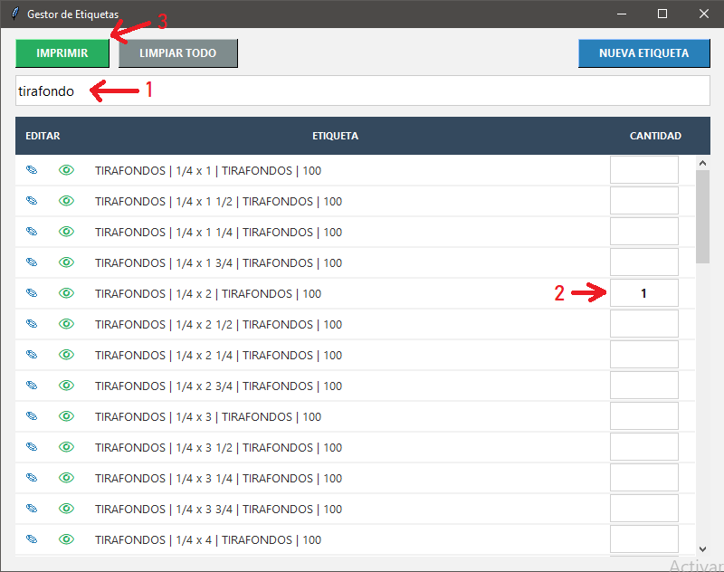

# 🏷️ Gestor de Etiquetas

Aplicación de escritorio para la gestión eficiente, generación de PDFs e impresión masiva de etiquetas de productos.


## 🚀 Instalación y Ejecución

Esta aplicación es portátil, por lo que no requiere una instalación compleja de Python.

1.  **Descargar:** Ve a la sección de **Releases** y descarga la última versión (archivo `.zip` o `.rar`).
2.  **Descomprimir:** Extrae el contenido del archivo descargado en la carpeta de tu elección.
3.  **Ejecutar:** Busca el archivo **`GestorEtiquetas.exe`** y haz doble clic para iniciar.

> **Nota:** Asegúrate de que los archivos adjuntos (como carpetas de recursos o `SumatraPDF.exe` si aplica) se mantengan en la misma carpeta que el ejecutable para el correcto funcionamiento de la impresión.

---

## 📖 Guía de Uso

### 1. Imprimir Etiquetas (Flujo Principal)



1.  **Buscar (1):** Utiliza la barra superior para buscar la etiqueta deseada por nombre, medida o carpeta.
2.  **Definir Cantidad (2):** En la columna derecha ("CANTIDAD"), ingresa el **número de hojas** que deseas imprimir para cada etiqueta.
3.  **Imprimir (3):** Una vez definidas las cantidades, presiona el botón verde **IMPRIMIR**.

* **Botón LIMPIAR TODO:** Borra todas las cantidades ingresadas en la lista para comenzar una nueva orden desde cero.

---

### 2. Gestión de Etiquetas

#### ✨ Crear Nueva Etiqueta
Presiona el botón azul **NUEVA ETIQUETA**. Se abrirá un formulario:

* **Carpeta / Tipo:** Indica la categoría del producto (esto creará la carpeta donde se guardará el PDF).
* **Artículo:** Nombre del producto.
* **Medida:** Dimensiones.
* **Cantidad:** La cantidad de unidades que contiene la bolsa (este número aparece en grande en la etiqueta).

Al guardar, se genera automáticamente el PDF y se registra en la base de datos.

#### ✏️ Modificar Etiqueta
1.  Busca la etiqueta en la lista.
2.  Presiona el icono del **Lápiz (✎)** a la izquierda de la fila.
3.  Modifica los datos en la ventana emergente y guarda los cambios.

#### 👁️ Previsualizar
Para ver cómo se ve el PDF antes de imprimir, presiona el icono del **Ojo (👁)**. Se abrirá una ventana con la etiqueta renderizada.

---

## 💻 Desarrollo y Compilación

Si deseas ejecutar el código fuente o compilarlo manualmente:

### Requisitos
* Python 3.8
* Librerías: `tkinter`, `sqlalchemy`, `reportlab`, `fitz` (PyMuPDF), `Pillow`.

### Compilación
Para generar el `.exe` usa el siguiente comando (requiere PyInstaller):

```bash
compilar.bat
```